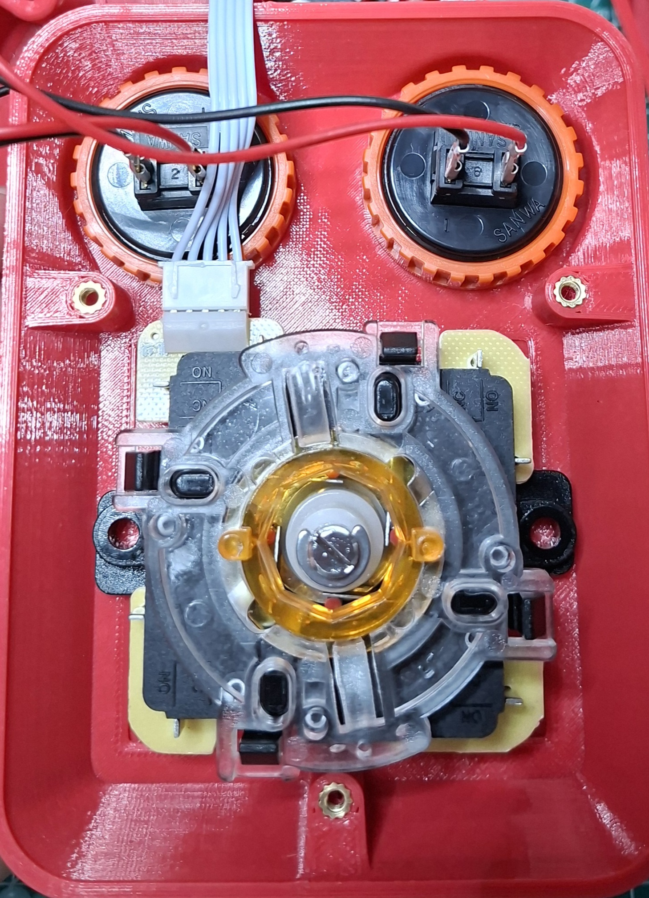

# Joystick

A retro style joystick with arcade parts and an rj45 port for easy cable management.

## assembly

Joystick fits only in non-standard orientation. no metal plate needed.  

[3d files](https://cad.onshape.com/documents/96a650fb4ce966bf403bef14/w/71dfbdc1e70c6a02d147e938/e/68f93b33a388599ce0cc54c4?renderMode=0&uiState=69bbfd8464b455470806eaa5)

